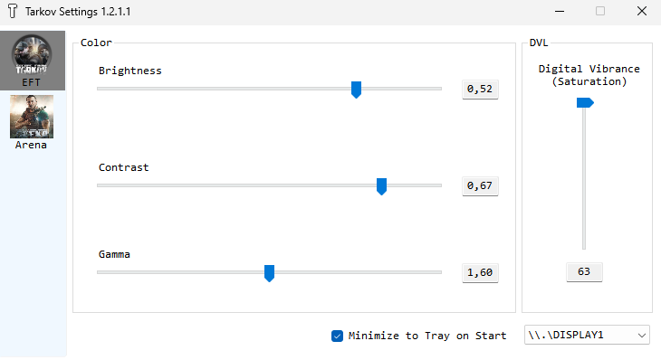

# tarkov-settings

## [Download](https://github.com/Ahmedrn/tarkov-settings/releases/latest)

Automatically change color settings for [Escape from Tarkov](https://escapefromtarkov.com) and [Escape from Tarkov Arena](https://arena.tarkov.com/).

---

## Credits
This project is a fork of [incheon-kim/tarkov-settings](https://github.com/incheon-kim/tarkov-settings) by Michael Kim.

---

## Changelog / Differences from Upstream
- Possibility to setup settings for both Escape From Tarkov and Escape from Tarkov Arena

---

## How it works?
- Changes Digital Vibrance value from Nvidia Settings using [NvAPIWrapper](https://github.com/falahati/NvAPIWrapper)
- Changes Gamma using some [Win32 API calls](https://docs.microsoft.com/en-us/windows/win32/api/wingdi/nf-wingdi-setdevicegammaramp)

It only changes your display's colors when Escape from Tarkov's window is in focus.
This leaves a smooth transition when minimizing/maximizing.

## Supported Graphic Cards
- Nvidia GPU **fully supported.** (Brightness/Contrast/Gamma/Saturation)
- AMD GPU **partially supported.** (Except Saturation)
- **Intel/Etc is not supported yet.**

## What does it do?
You can change any of the following color settings:
1. Brightness
2. Contrast
3. Gamma
4. Digital Vibrance Control (aka. Saturation)
5. Only affects display while EFT window is focussed (It also prevents **sudden flash during Alt-tabbing**)

## How to Use
1. Open application (SmartGuard might prevent opening as it's not signed)
2. Set any color value
2.1. Double-click any slider labels to reset their values.
3. Minimize and play EFT
4. Close application if you want to deactivate

**Exit the app from your taskbar to create a `settings.json` file that will remember your settings**

## Warning
1. It might blink couple times when you active EFT window but it works. Don't worry.
2. **Disclaimer: I don't know BSG will ban for using this.**
3. AMD only supports Brightness/Contrast/Gamma Controls
4. Intel Graphic Cards are not supported
5. Only works in **Borderless mode.**
6. Nvidia Optimus Environment (mostly laptops) is not tested.

## TODO / Feature
- [x] Process Focusing Awareness
- [x] Digital Vibrance Value Change
- [x] Gamma Value Change
- [x] Brightness, Contrast, Gamma Value modify
- [x] GUI
- [x] ini or json configuration
- [x] Process Changeability (Not only for EscapeFromTarkov)
- [x] change display(monitor) target
- [x] Minimize to tray
- [ ] Profiles
- [ ] Hot Keys
- [ ] EFT setting modify (Framelimit or Graphic Settings)

Thanks for your support!

---

## License
This project is licensed under the [LGPL-2.1](./LICENSE). See the LICENSE file for details.
